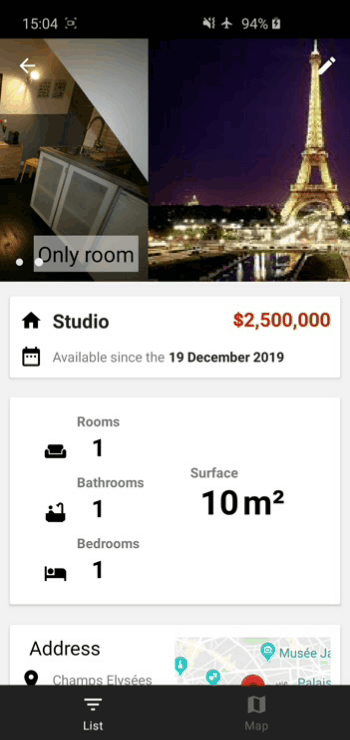

# RealEstateManager
Project 9 for [OpenClassrooms](https://openclassrooms.com) (training purpose)

Android app for real estate agents to make the estates management easier with features like a list, a map, 
a mortgage calculator, and the possibility to add, update and filter the estates

- 100% Kotlin
- Include Android Architecture components : Viewmodels, Livedata, Room
- Data Binding
- Follow the material guidelines for design (including Bottom navigation, Navigation drawer etc...)

Main screen with and without items :

 

The map with markers of estates around user's location :

Adding an estates (loading images from Gallery or Camera :

  

Details of an estate view :

  

Photos slider :

Collapsing toolbar :

Filter options :

Navigation drawer :

You can switch between 2 currencies :

Mortgage calculator :

